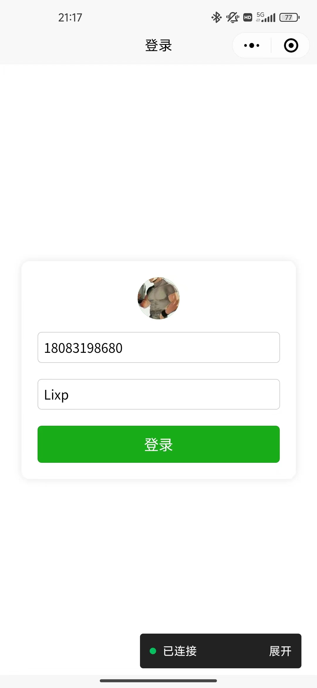
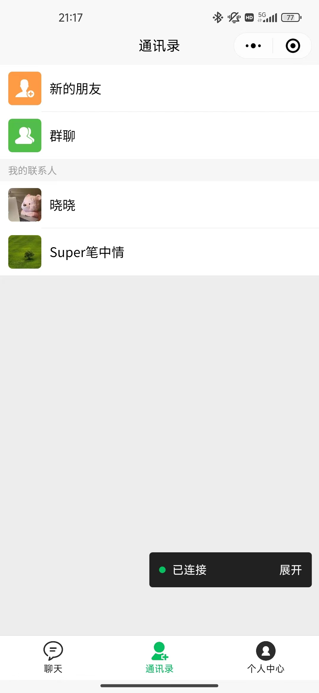
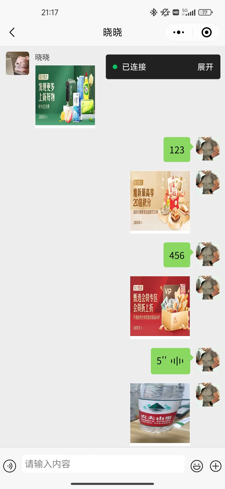
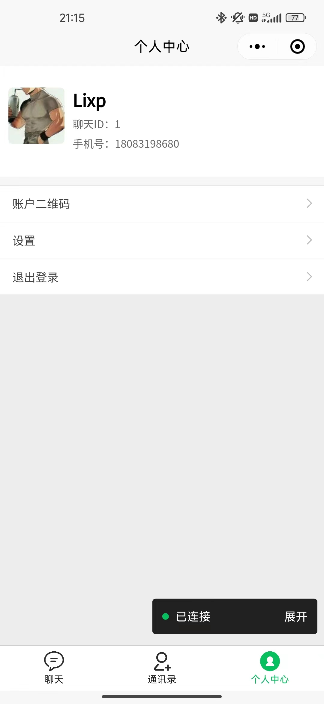

# chat-gin-server

#### 介绍
基于gin搭建的聊天服务端

#### 相关框架
gin、gorilla/websocket、jwt、trace、gorm、gen、logger、snowflake、redis、viper

#### 安装教程

1.  xxxx
2.  xxxx
3.  xxxx

#### 使用说明

1.  xxxx
2.  xxxx
3.  xxxx

#### 参与贡献

1.  Fork 本仓库
2.  新建 Feat_xxx 分支
3.  提交代码
4.  新建 Pull Request

#### 功能清单
- 登录（手机号登录、微信授权登录）
- 搜索好友
- 添加好友
- 创建群聊
- 邀请用户加群
- 发送私聊消息
- 发送群聊消息
- 获取好友列表

#### 小程序

